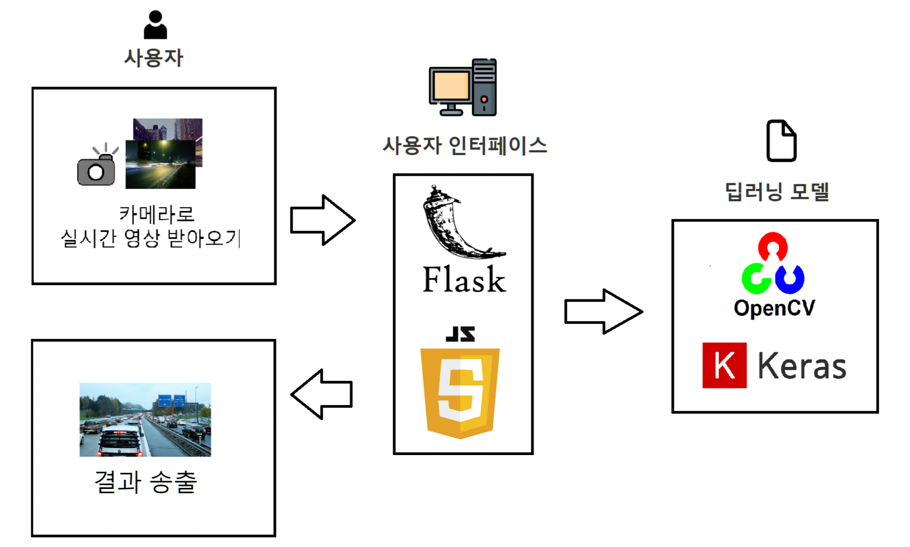
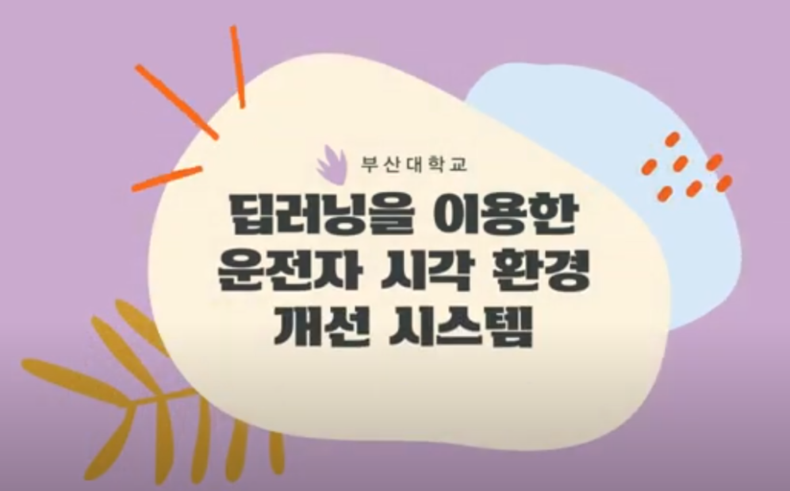
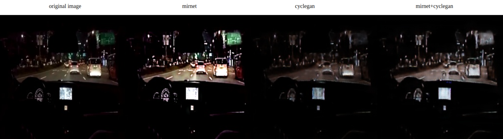

## 1. 프로젝트 소개

야간 운전 주행시 운전자의 시각을 개선하고자 빛 번짐 완화 모델과 밝기 개선 모델을 개발한다. 실시간으로 영상을 받아와 실시간으로 재생하는 것을 목표로 한다.

## 2. 팀 소개

1. 김명서, mia2583@pusan.ac.kr, 빛 번짐 완화 모델 개발 (CycleGAN)
2. 나인수, i12force@pusan.ac.kr, 밝기 개선 모델 개발 (MIRNet)
3. 김도은, de1125@pusan.ac.k, 밝기 개선 모델 개발 (zero-DCE)

## 3. 구성도



- flask를 사용하여 간단한 웹 페이지 제작
- openCV를 사용하여 데이터 전처리
- 인공지능 모델로 keras와 pytorch 사용
- rtsp 프로토콜을 사용하여 영상을 실시간으로 수신
- 인공지능을 통해 빛 번짐 완화, 밝기 개선 후 결과 출력

## 4. 소개 및 시연 영상

[](https://www.youtube.com/watch?v=tGyWVk4Tg2s&list=PLFUP9jG-TDp96chsm66TfMPlAJXIt6Gr9&index=8)

## 5. 사용법

1. python 가상환경 설치 및 실행

```
python3 -m venv test
cd test
. bin/activate
```

2. 코드 클론하기
```
git clone git@github.com:pnucse-capstone/capstone-2023-1-8.git
cd capstone-2023-1-8
```

3. 필요 라이브러리 설치
```
pip install -r requirements.txt
```

4. 실행하기
```
python3 app.py
```

